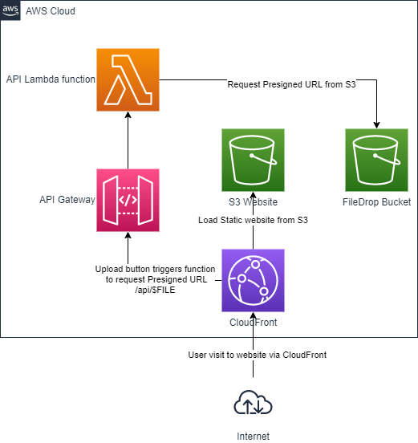

# Serverless S3 FileDrop

Simple File Drop service to run in AWS. 

* Upload using Pregenerated URL via Web UI
* Notification and download link when new file uploaded

## How this works?




## Deploy

You have to setup AWS Access Keys to deploy.

Install required Node-packages

```
npm ci
```

And then deploy to AWS. Change `PREFIX` to prefix you like to use. This will be used in S3 bucket name eg.

```
cp .env.example .env
serverless deploy
```

## Develop

Install required Node-packages

```
npm ci
```

Start development environment. This will start API Gateway in localhost:4000.

```
serverless offline
```