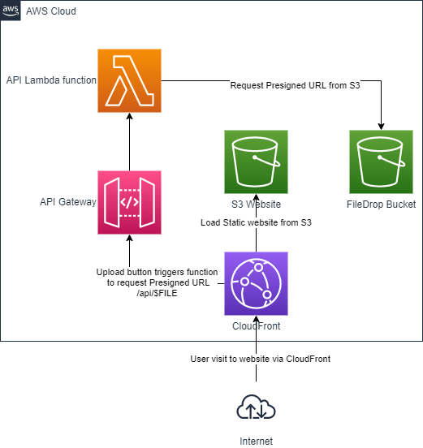
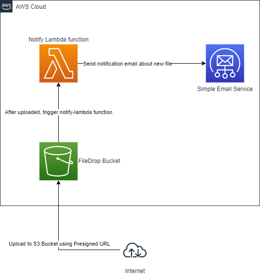

# Serverless S3 FileDrop

Simple File Drop service to run in AWS. 

* Upload using Pregenerated URL via Web UI
* Email Notification and download link when new file uploaded

## How this works?

1. Get Presigned URL



2. Upload to S3 Bucket



3. Automatically notify user via AWS SES Service. You have to have domain verified in SES service.

## Deploy

You have to setup AWS Access Keys to deploy.

Install required Node-packages

```
npm ci
```

Configure environment variables in `.env` file before deploy. 

```
cp .env.example .env
serverless deploy
```

## Develop

Install required Node-packages

```
npm ci
```

Start development environment. This will start API Gateway in localhost:4000.

```
serverless offline
```